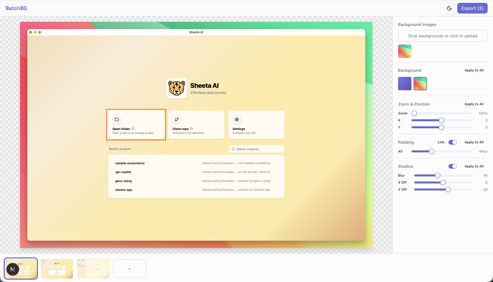

# BatchBG

Try it live: https://batchbg.vercel.app/

A web app for adding beautiful backgrounds to your screenshots in batch. Upload your screenshots, pick a background, adjust settings, and export them all at once.

Think of it as the background feature from Screen Studio, but for any screenshot.



## Features

- Upload multiple screenshots at once
- Upload custom background images or use built-in gradients
- Adjust background zoom and position
- Control padding and drop shadow per screenshot
- Apply settings to all screenshots with one click
- Copy/paste settings between screenshots (Cmd+C / Cmd+V)
- Multi-select screenshots with Shift+click
- Export all screenshots as PNG/JPG with configurable resolution and quality
- Light and dark theme support

## Getting Started

```bash
npm install
npm run dev
```

Open [http://localhost:3000](http://localhost:3000).

## Tech Stack

- Next.js 16
- React 19
- Tailwind CSS 4
- shadcn/ui
- Zustand
- Canvas API for rendering

## Contributing

Contributions are welcome. Feel free to open issues and pull requests.

## License

MIT
